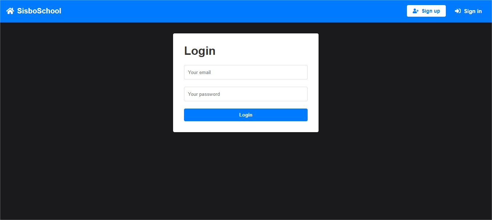
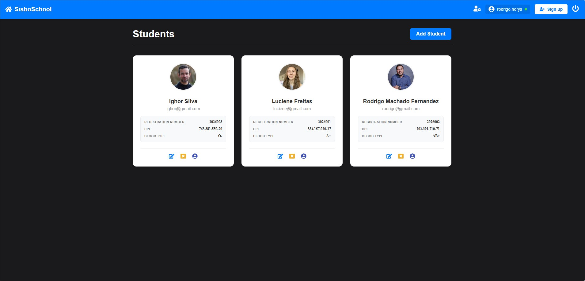
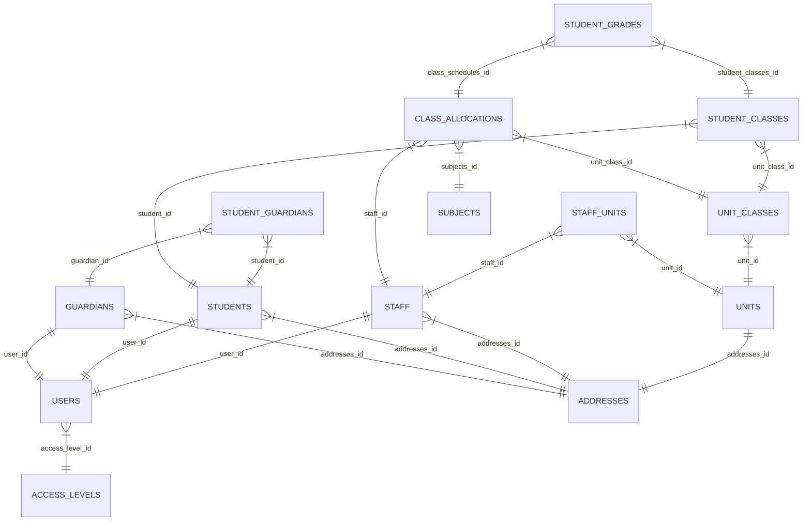

# 🎓 Student Management System

> MVP de um sistema para gestão acadêmica, focado na validação da arquitetura de dados e fluxo de notas.


### 🔗 Acesso Rápido
- **Live Demo (Aplicação Rodando):** [sisbodeveloper.com.br](https://sisbodeveloper.com.br)
- **Visão Futura (Schema Completo):** [Visualizar no DrawDB](https://drawdb.vercel.app/editor?shareId=a7577e72fc3ab1a93bfe9f09ab3c4b5c)

---

## 💻 Sobre o Projeto

O **Student Management System** é uma aplicação Full Stack em desenvolvimento contínuo. Atualmente em fase de **MVP (Minimum Viable Product)**, o projeto foca em validar as regras de negócio essenciais: cadastro, enturmação e lançamento de notas.

O grande diferencial técnico reside na **Modelagem do Banco de Dados** (disponível no link acima). Embora a aplicação atual implemente o fluxo básico, o banco já foi arquitetado suportar funcionalidades complexas futuras, como multi-tenancy e histórico escolar evolutivo, demonstrando planejamento de longo prazo.

### ✨ Status das Funcionalidades

#### ✅ Implementado (MVP Atual)
- **Autenticação Base:** Estrutura de usuários (`users`) pronta e integrada para login seguro.
- **Gestão Discente:** Tabela de Alunos (`students`) funcional, permitindo cadastro e persistência de dados.
- **Gestão de Mídia:** Sistema de upload e armazenamento de fotos de perfil (`photos`) integrado ao banco.
- **Versionamento de Banco:** Controle de migrações ativo e auditável via `sequelizemeta`.

#### 🚧 Em Desenvolvimento / Modelado
- **Controle de Acesso (RBAC):** Tabela `access_levels` com flags booleanas (`manage_account`, `manage_finance`) para permissões granulares.
- **Gestão de Staff:** Vínculo de professores a múltiplas unidades escolares via tabela pivô `staff_units` (N:N).
- **Rede de Responsáveis:** Relacionamento entre alunos e responsáveis (`student_guardians`) com flag de responsabilidade financeira.
- **Grade Horária (Alocação):** Tabela `class_allocations` modelada para cruzar Professor, Turma e Disciplina (`subjects`).
- **Sistema de Avaliação:** Estrutura de notas (`student_grades`) vinculada à alocação da aula, permitindo histórico detalhado por bimestre.


## 📸 Screenshots

| Login | Dashboard |
|:---:|:---:|
|  |  |

---

## 🗄️ Arquitetura de Dados
A modelagem do banco de dados segue rigorosos princípios de **normalização** e **integridade referencial** (Foreign Keys e Constraints), dividida em 4 camadas lógicas para facilitar a manutenção e escalabilidade.

### 🗺️ Visualização Interativa
Visualize a estrutura completa, relacionamentos e tipos de dados diretamente no navegador via DrawDB:

[](https://drawdb.vercel.app/editor?shareId=a7577e72fc3ab1a93bfe9f09ab3c4b5c)

> **Backup:** </br>
> O arquivo JSON da estrutura também está disponível em [`docs/database/school_schema_v2.0.0.json`](./docs/database/school_schema_v2.0.0.json).</br>
> O arquivo SQL da estrutura também está disponível em</br> [`docs/database/init.sql`](./docs/database/init.sql).

### Diagrama Simplificado (Mermaid)

## 🚀 Infraestrutura & Deploy
Diferente de projetos acadêmicos comuns, esta aplicação está hospedada em um ambiente de produção real (VPS), aplicando conceitos de DevOps e administração de servidores:

- **Servidor** : VPS Linux (Ubuntu/CentOS).
- **Web Server** : Nginx configurado como Reverse Proxy.
- **Gerenciamento de Processos** : Docker (Restart Policy).
- **Segurança** : SSL/TLS (HTTPS) via Certbot.

Aqui está o trecho formatado com a sintaxe correta de Markdown (código, negrito e links) para você copiar e colar:

## 🔧 Como Rodar Localmente

## Pré-requisitos
* **Node.js:** v20+ (Recomendado v20.20.0 ou superior)
* **Banco de Dados:** MariaDB 10.11


### 1. Clone o repositório
```bash
git clone [https://github.com/rodrigo-norys/student-management-system.git](https://github.com/rodrigo-norys/student-management-system.git)
cd student-management-system
```

### 2. Configuração do Backend

```bash
cd backend
npm install
# Crie um arquivo .env na raiz do backend com suas credenciais do DB
# Exemplo: DB_HOST=localhost, DB_USER=root, DB_PASS=senha
npm start
```

### 3. Configuração do Frontend
```bash
cd frontend
npm install
npm run dev
```

## 🛠️ Tecnologias Utilizadas
* **Backend:** Node.js, Express, Sequelize ORM, JWT, Bcrypt.
* **Frontend:** React.js, Axios, Styled Components / CSS Modules.
* **Banco de Dados:** MySQL.
* **Infra:** Nginx, Docker, Linux.


## 📂 Estrutura do Projeto
```bash
student-management-system/
├── backend/         # API Node.js, Models e Controllers
├── frontend/        # Aplicação React
└── docs/            # Documentação e Diagramas do Banco
```
---

**Desenvolvido por Rodrigo Norys**


[LinkedIn](https://www.google.com/search?q=https://linkedin.com/in/rodrigo-norys) | [Portfólio](https://sisbodeveloper.com.br)


