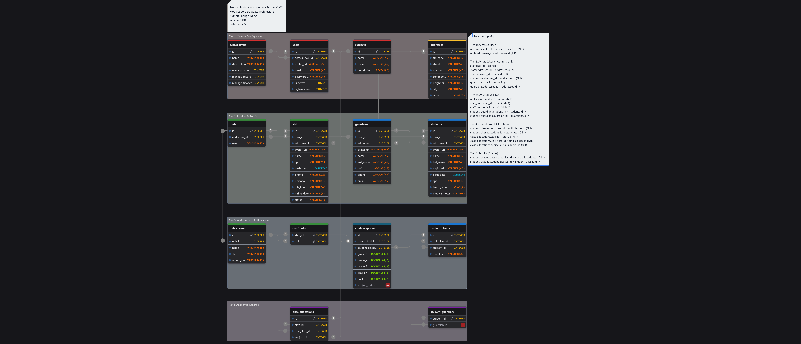

# 🎓 Student Management System

> Um sistema completo para gestão escolar, focado em controle acadêmico, enturmação e lançamento de notas.


[](https://sisbodeveloper.com.br/)


## 💻 Sobre o Projeto

Este projeto é uma aplicação Full Stack desenvolvida para gerenciar o fluxo de dados de uma instituição de ensino. O objetivo é resolver o problema de integridade de dados entre matrículas, notas e histórico escolar.

O sistema permite o cadastro de alunos, gestão de turmas, alocação de professores (grade horária) e o processamento de aprovação/reprovação automática com base nas notas lançadas.

## 🗄️ Modelagem do Banco de Dados (EM DESEMVOLVIMENTO...)

O banco de dados foi projetado  para garantir a integridade e evitar redundâncias.

Abaixo, o Diagrama Entidade-Relacionamento (DER) utilizado:

<div align="center">
  
</div>

> **Nota Técnica:** O arquivo editável do MySQL Workbench (`.mwb`) está disponível na pasta [`/docs/database`](./docs/database).

### Principais Decisões de Arquitetura:
* **Separação de Responsabilidades:** Dados de acesso (`users`) separados de dados de perfil (`students`, `staff`).
* **Histórico Acadêmico:** Tabela `student_grades` atua como pivô, conectando o aluno à aula específica e registrando o desempenho individual.
* **Grade Horária Flexível:** A tabela `class_schedules` permite que múltiplos professores lecionem diferentes matérias na mesma turma (relação N:N).

## ✨ Funcionalidades

- **Autenticação** (Login)
- **Autorização** (Níveis de Acesso)
- **Gestão de Pessoas** (Alunos, Professores e Staff)
- **Enturmação** (Matrícula de alunos em turmas anuais)
- **Grade Horária** (Atribuição de professores a matérias)
- **Boletim** (Lançamento de notas e cálculo de média)
- **Relatórios** (Listas de presença e histórico)

## 🚀 Tecnologias Utilizadas

### Backend
- **Node.js** & **Express**
- **Sequelize ORM** (Gestão do SQL)
- **MySQL** (Banco de Dados)
- **JWT** (Autenticação)

### Frontend
- **React.js**
- **Axios** (Consumo de API)
- **CSS Modules / Styled Components**

## 📂 Estrutura do Projeto

```bash
student-management-system/
├── backend/         # API Node.js, Models e Controllers
├── frontend/        # Aplicação React
└── docs/            # Documentação e Diagramas do Banco