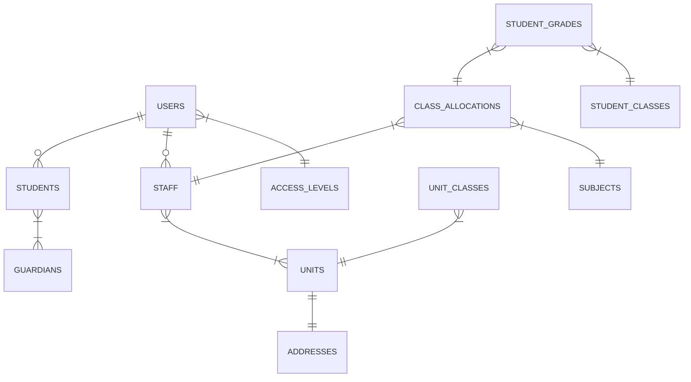

# 🎓 Student Management System

> Um sistema completo para gestão escolar, focado em controle acadêmico, enturmação e lançamento de notas.


[](https://sisbodeveloper.com.br/)


## 💻 Sobre o Projeto

Este projeto é uma aplicação Full Stack desenvolvida para gerenciar o fluxo de dados de uma instituição de ensino. O objetivo é resolver o problema de integridade de dados entre matrículas, notas e histórico escolar.

O sistema permite o cadastro de alunos, gestão de turmas, alocação de professores (grade horária) e o processamento de aprovação/reprovação automática com base nas notas lançadas.

## 🗄️ Arquitetura do Banco de Dados

O banco de dados foi modelado seguindo os princípios de **normalização** e **integridade referencial**, dividido em 4 camadas lógicas (Context Tiers) para facilitar a manutenção e escalabilidade.

### 🗺️ Visão Macro (Relacionamentos Principais)
> Diagrama gerado automaticamente via Mermaid.js


> **🛠️ Recursos do Diagrama**
> 1. Baixe o arquivo [`docs/database/school_schema_v1.json`](./docs/database/school_schema_v1.json).
> 2. Acesse [drawdb.app](https://www.drawdb.app/editor).
> 3. Clique em **File > Import** e carregue o arquivo.
> 
> O script de criação do banco está disponível em [`docs/database/init.sql`](./docs/database/init.sql).</br>
> Para uma rápida visualização, pode acessar o PNG em [`docs/database/school_diagram.png`](./docs/database/school_diagram.png).

## ✨ Funcionalidades

- **Autenticação** (Login)
- **Autorização** (Níveis de Acesso)
- **Gestão de Pessoas** (Alunos, Professores e Staff)
- **Enturmação** (Matrícula de alunos em turmas anuais)
- **Grade Horária** (Atribuição de professores a matérias)
- **Boletim** (Lançamento de notas e cálculo de média)
- **Relatórios** (Listas de presença e histórico)

## 🚀 Tecnologias Utilizadas

### Backend
- **Node.js** & **Express**
- **Sequelize ORM** (Gestão do SQL)
- **MySQL** (Banco de Dados)
- **JWT** (Autenticação)

### Frontend
- **React.js**
- **Axios** (Consumo de API)
- **CSS Modules / Styled Components**

## 📂 Estrutura do Projeto

```bash
student-management-system/
├── backend/         # API Node.js, Models e Controllers
├── frontend/        # Aplicação React
└── docs/            # Documentação e Diagramas do Banco


